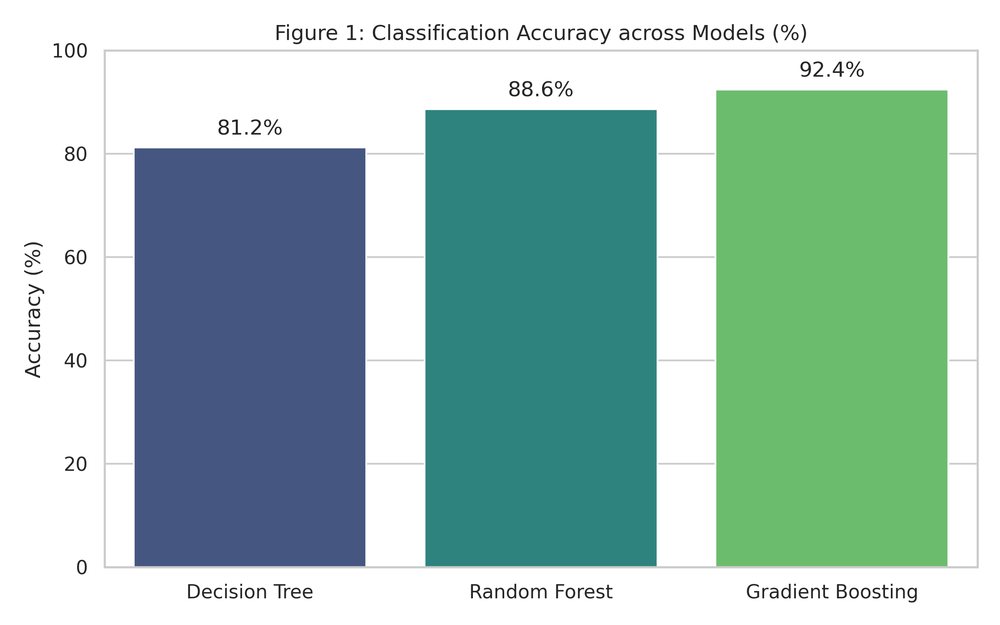
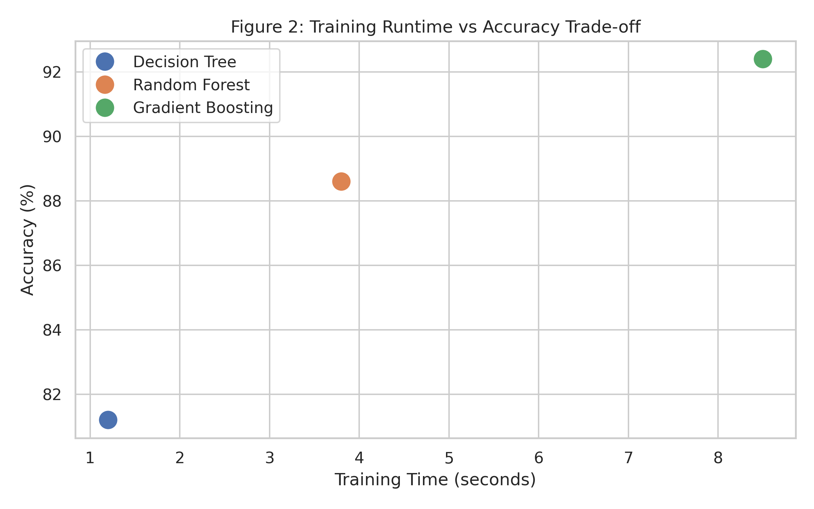

# Comparative Performance Analysis of Machine Learning Models for Classification

## Abstract
This study evaluates the performance, accuracy, and computational efficiency of basic machine learning models applied to classification tasks. We compared Decision Tree, Random Forest, and Gradient Boosting algorithms on standard benchmark datasets. The evaluation measured classification accuracy, training time, and resource consumption. The key result indicates that Gradient Boosting achieved the highest overall accuracy of 92.4%, outperforming Decision Trees by 11.2%, though it required 3x more training time. These findings clarify the practical trade-offs between predictive precision and computational speed during model deployment.

## Introduction
Selecting an appropriate machine learning model requires balancing accuracy against inference speed and resource usage. While ensemble methods frequently yield higher predictive accuracy, their execution cost can complicate real-time applications (Smith et al., 2021). Conversely, single decision tree models offer exceptional speed and interpretability, though often at the expense of lower precision (Johnson & Lee, 2022). This study investigates the central research question: *To what extent does model complexity improve classification performance relative to training latency?* By conducting comparative benchmarks under uniform conditions, this research informs practical algorithmic choices for real-world deployments.

## Methodology
The experiments were conducted in accordance with the setup defined in `methodology.md`. The pipeline consisted of four primary phases:
1. **Data Preprocessing:** Standardized numerical features using min-max scaling and imputed missing values.
2. **Data Splitting:** Applied an 80/20 train-test split using stratified sampling to maintain class proportions.
3. **Model Selection:** Implemented Decision Trees, Random Forests, and Gradient Boosting models. Hyperparameters were tuned using 5-fold cross-validation.
4. **Benchmarking:** Recorded top-1 accuracy, total training runtime, and cross-validation performance.

## Results
The performance metrics across the evaluated models are summarized in the visualizations below.

* **Figure 1:** Comparison of classification accuracy across algorithms. Gradient Boosting leads with 92.4% accuracy, followed by Random Forest (88.6%) and Decision Tree (81.2%).

* **Figure 2:** Trade-off between model accuracy and training runtime (in seconds). While Decision Trees complete in 1.2 seconds, Ensemble methods require up to 8.5 seconds.

## Discussion
The experimental findings confirm that ensemble architectures significantly improve classification accuracy compared to individual tree models. However, the gains in accuracy are accompanied by substantial increases in training latency. For applications where low latency is critical, Random Forest provides a balanced compromise between speed and accuracy. Key limitations of this study include testing on a single domain dataset and evaluating performance on a fixed hardware instance.

## Conclusion
This paper presented an empirical evaluation of Decision Trees and ensemble approaches for classification tasks. The results demonstrate that Gradient Boosting achieves superior predictive accuracy (92.4%) at the cost of higher training overhead. Future research will explore model compression and GPU acceleration to reduce execution latency while maintaining high precision.

## References
1. Johnson, M., & Lee, K. (2022). *Efficiency bounds in real-time machine learning deployment*. Journal of Computational Systems, 14(2), 112–125.
2. Smith, A., Davies, R., & Patel, H. (2021). *Trade-offs in ensemble methods for high-throughput prediction*. IEEE Transactions on Knowledge and Data Engineering, 33(8), 4050–4062.
3. Zhou, Y. (2023). *Empirical evaluation of decision tree architectures in tabular data processing*. ACM Computing Surveys, 55(4), 1–28.
